<div align="center">

# ForensicVision

**A native desktop workstation for forensic image analysis and enhancement — that tells you which parts of the result were measured and which were invented.**

[](LICENSE)
[](https://www.python.org/)
[](https://riverbankcomputing.com/software/pyqt/)

[](#testing)
[](#privacy-and-offline-operation)
[](docs/GPU_SETUP.md)

[**Website**](https://sihabsahariar.github.io/ForensicVision/) · [Quick start](#quick-start) · [Screenshots](#screenshots) · [Comparison](#how-it-compares) · [Docs](#documentation) · [Roadmap](#roadmap) · [Contributing](#contributing)

</div>

<p align="center">
  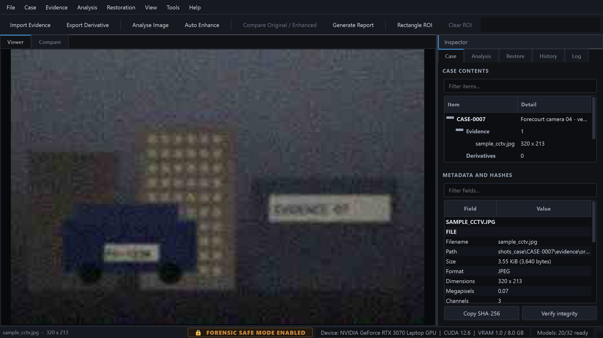
</p>

---

ForensicVision imports evidence under a documented chain of custody, measures what
is wrong with an image, **proposes** a restoration pipeline for the investigator to
review, executes it on GPU or CPU, and produces a PDF report that states exactly
what was done and what it does not prove.

It is a desktop application — PyQt5, no web frontend, no browser, no telemetry, no
cloud dependency. Everything runs on your machine.

## Contents

- [The problem it exists to solve](#the-problem-it-exists-to-solve)
- [Screenshots](#screenshots)
- [How it compares](#how-it-compares)
- [Quick start](#quick-start)
- [What it measures](#what-it-measures)
- [Restoration models](#restoration-models)
- [Face restoration, and why it is fenced off](#face-restoration-and-why-it-is-fenced-off)
- [Forensic Safe Mode](#forensic-safe-mode)
- [Using the engine without the GUI](#using-the-engine-without-the-gui)
- [Privacy and offline operation](#privacy-and-offline-operation)
- [Documentation](#documentation)
- [Keyboard shortcuts](#keyboard-shortcuts)
- [Testing](#testing)
- [Roadmap](#roadmap)
- [Contributing](#contributing)
- [Licence](#licence)
- [Author](#author)

---

## The problem it exists to solve

Image enhancement in a forensic context is dangerous in one specific way: a learned
model can produce a result that *looks* like recovered detail but is actually
invented. A super-resolution network asked for a licence plate will give you a
licence plate — crisp, confident, and possibly not the one that was there.

ForensicVision is built around keeping that distinction visible at every step.

### Two clearly separated operator classes

|  | Classical | Neural |
|---|---|---|
| What it is | Deterministic signal processing | Trained networks |
| Can it invent detail? | **Never** — every output sample derives from measured input samples | **Usually** — but each model declares it individually; see below |
| Needs a download? | No | Yes, and only when you explicitly approve it |
| Marked in the UI | `Classical (deterministic DSP)` | `Neural (learned prior)` + warning |
| In reports | Listed as deterministic | Flagged **`may synthesise`** |

The distinction is declared once, in each model's metadata, and surfaces everywhere
it matters: the restoration panel, the pipeline review dialog, the confirmation
prompt, the case tree colouring, the provenance sidecar, the database row and the
PDF report. All ten classical operators work immediately after `pip install`.

**Kind and synthesis are two axes, not one.** Four of the twenty-two neural
models are declared incapable of synthesising, and the reason is structural
rather than a judgement call. Zero-DCE outputs the coefficients of a tone curve
rather than pixels, and that curve is provably monotonic, so each output pixel is
a monotone function of *that pixel's own input value* — no learned prior can
paint an edge, a character or a face into it. DnCNN is discriminative: it
predicts and subtracts a noise residual with no image prior to draw new structure
from. A report can therefore read `neural` and `may synthesise: no` on the same
line, and both are true. Collapsing the axes would make the warning meaningless
exactly where it matters — you could no longer tell CodeFormer, which invents
faces, from a tone curve.

### Nothing is faked

- A model whose weights are absent shows **Weights missing** and an *Install*
  button — never a substitute result.
- A model that is declared but not integrated says so and explains precisely what
  is missing.
- Weights are **never** downloaded silently. The Model Manager shows the licence,
  size, digest and source URL, and waits for you to press *Install*.

### The original is never touched

Evidence is copied into the case, hashed with SHA-256 / SHA-512 / MD5, and made
read-only. Every derivative is a new file with its own hashes and a provenance
sidecar recording the input digest, the model, its version and licence, every
parameter, the device and the timestamp. Step *N*'s output digest equals step
*N+1*'s input digest, so the chain is verifiable link by link — not just end to
end.

---

## Screenshots

> The sample shown throughout is **synthetic evidence** generated by
> `scripts/make_sample.py` — a 320×213 frame degraded with blur, sensor noise and
> quality-28 JPEG compression. No real case material is distributed with this
> project.

### Analysis — nine degradation indicators, with the raw measurements behind each

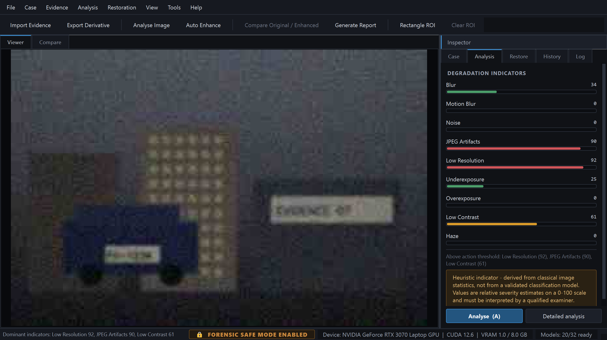

Every indicator reports a 0–100 severity *and* the estimator that produced it. All
are labelled as heuristic indicators derived from classical image statistics, not
the output of a validated classifier.

### The pipeline is proposed, not applied

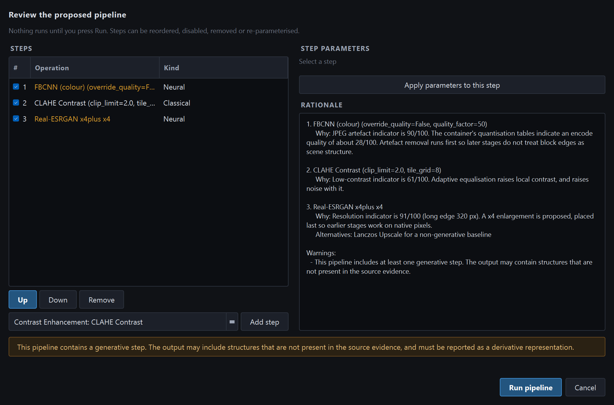

**Nothing runs until you press Run.** Each step carries a rationale tied to the
measurement that triggered it, offers a non-generative alternative where one
exists, and neural steps are highlighted with an explicit warning banner. Steps can
be reordered, disabled, re-parameterised or removed.

### Before / after, locked to the same field of view

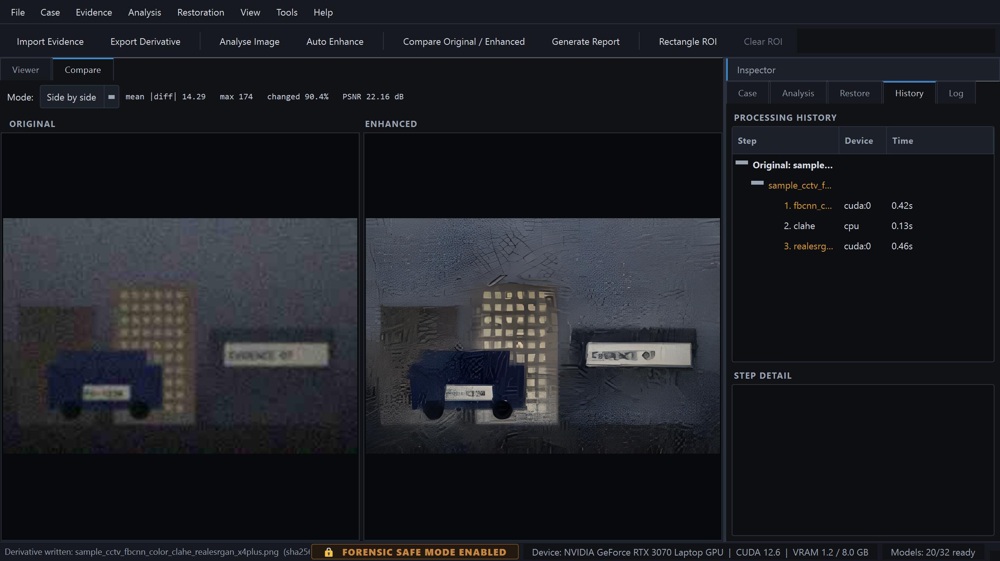

The panes stay locked at the same *apparent* scale even when the derivative is 4×
larger, and the processing history shows every step, its device and its duration.

### Difference analysis — labelled as a visualisation, not as evidence

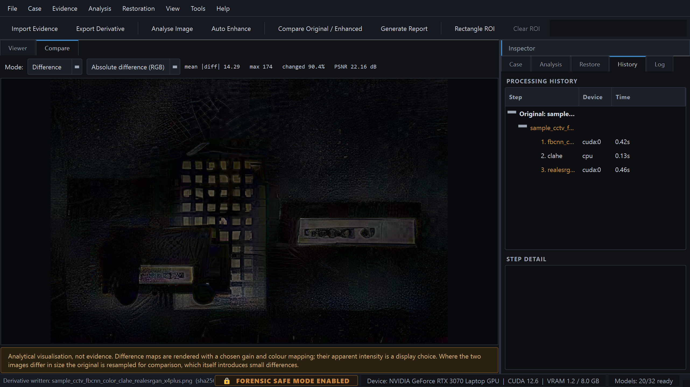

Five difference modes — absolute RGB, grayscale, amplified ×8, edge and heatmap —
with PSNR and changed-pixel statistics, and a permanent caveat that the apparent
intensity of a difference map is a display choice.

### Everything on right-click, so the image gets the room

<p align="center">
  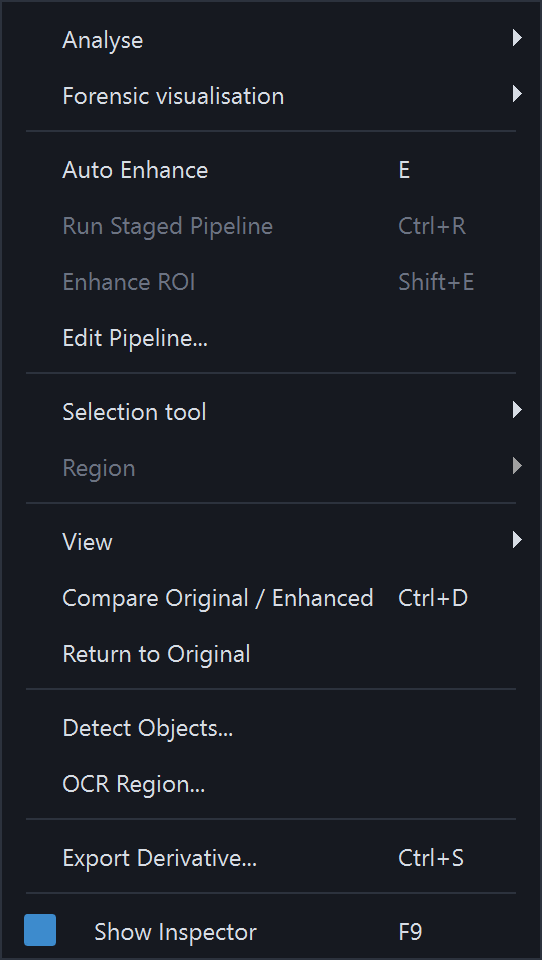
  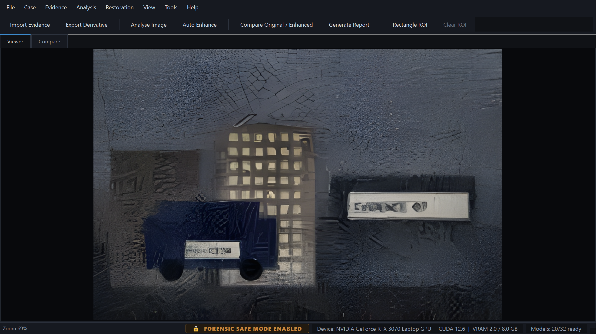
</p>

One tabbed inspector rather than six competing docks. The image gets **59%** of the
window by default and **82%** in focus mode (`F11`). The viewer does not build the
context menu itself — it emits a signal and the main window populates it from the
*same* `QAction` objects the menu bar and toolbar use, so enabled state and
shortcuts can never drift apart.

### Model Manager — licence, size, digest and source, before anything downloads

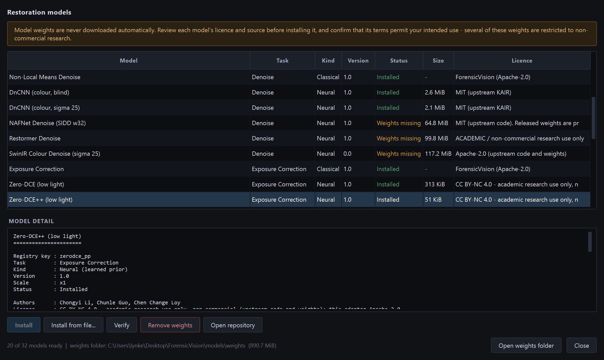

### Forensic visualisations

<p align="center">
  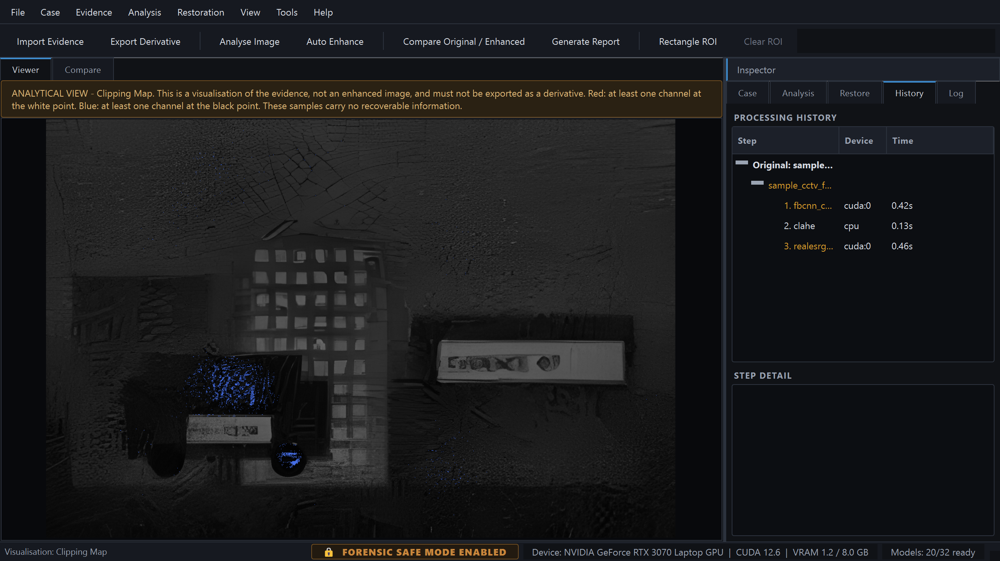
  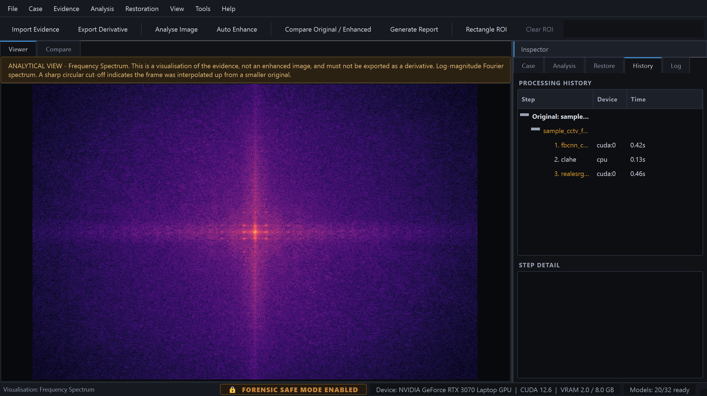
</p>

Histograms, per-channel statistics, clipping maps, error level analysis, frequency
spectra and noise maps — overlaid on the image without modifying it.

### The report

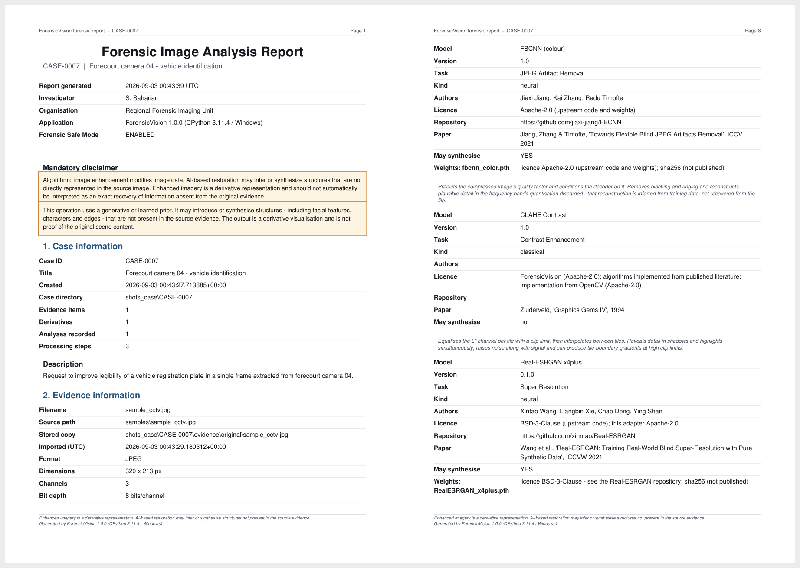

Fourteen sections: case, evidence, hashes, metadata, analysis, pipeline **with
rationale**, parameters, model provenance (authors, licence, paper, weight digest,
`may synthesise`), before/after, difference, history, audit trail and limitations.
The mandatory disclaimer appears on the title page *and* in the footer of every
page, so a printed extract can never lose it.

---

## How it compares

|  | **ForensicVision** | Amped FIVE | Photoshop / Camera Raw | GIMP + G'MIC | chaiNNer · Upscayl | Topaz Photo AI |
|---|:---:|:---:|:---:|:---:|:---:|:---:|
| Licence | **Apache-2.0, open** | Commercial, closed | Commercial, closed | GPL, open | GPL/AGPL, open | Commercial, closed |
| Cost | **Free** | Paid, per seat | Subscription | Free | Free | Paid |
| Purpose-built for forensics | ✅ | ✅ | ❌ | ❌ | ❌ | ❌ |
| Case and evidence management | ✅ | ✅ | ❌ | ❌ | ❌ | ❌ |
| Cryptographic evidence hashing | ✅ | ✅ | ❌ | ❌ | ❌ | ❌ |
| Per-derivative provenance record | ✅ | ✅ | ◐ XMP history | ❌ | ❌ | ❌ |
| Append-only audit trail | ✅ | ✅ | ❌ | ❌ | ❌ | ❌ |
| Automated forensic PDF report | ✅ | ✅ | ❌ | ❌ | ❌ | ❌ |
| Classical / deterministic operators | 10 | Extensive | ✅ | Extensive | ❌ | ❌ |
| Deep-learning restoration | 20 adapters | — | ◐ | via plug-ins | ✅ | ✅ |
| **Per-step "may synthesise" labelling** | ✅ | — | ❌ | ❌ | ❌ | ❌ |
| **Explains why each step is proposed** | ✅ | — | ❌ | ❌ | ❌ | ❌ |
| **Review-before-run pipeline gate** | ✅ | — | ❌ | ❌ | ◐ | ❌ |
| Runs fully offline, no account | ✅ | ✅ | ❌ | ✅ | ✅ | ◐ |
| Never auto-downloads model weights | ✅ | n/a | n/a | n/a | ❌ | n/a |
| Reusable headless engine | ✅ | ❌ | ❌ | ◐ Script-Fu | ✅ | ❌ |
| **Video / DVR support** | ❌ | ✅ | ❌ | ❌ | ❌ | ❌ |
| **Established in court** | ❌ **none** | ✅ **extensive** | n/a | n/a | n/a | n/a |
| **Vendor support, training, certification** | ❌ | ✅ | ✅ | community | community | ✅ |
| Platforms | Win, Linux | Windows | Win, macOS | Win, macOS, Linux | Win, macOS, Linux | Win, macOS |

<sub>✅ yes · ◐ partial · ❌ no · — not a documented feature we were able to confirm.
Commercial feature sets change; verify current capabilities with the vendor. The
last four rows are where ForensicVision loses, and they are listed on purpose.</sub>

### Where ForensicVision fits

**Against research repositories** — Real-ESRGAN, CodeFormer and SwinIR CLIs,
chaiNNer, Upscayl. These give you the *model*, not the *workflow*. There is no
case, no hash, no record of what was run with which parameters on which device, and
no report. More importantly, they present the neural output as "the enhanced
image," full stop. ForensicVision runs the same networks — the same official
checkpoints — but every output is a registered derivative with a provenance chain,
and every generative step is labelled as one.

**Against general-purpose editors** — Photoshop, GIMP, Affinity. Enormously more
capable as editors, and completely unsuited to evidence handling: the workflow is
destructive by default, nothing in the saved result distinguishes a deterministic
filter from a generative fill, and there is no chain of custody. They are also
where most improvised forensic enhancement actually happens, which is the problem
this project is a response to.

**Against commercial forensic suites** — Amped FIVE above all. These are the
professional standard, with a substantial court record, video and DVR support, a
far broader filter set, and vendor validation and training behind them.
**ForensicVision does not replace them, and this project makes no claim of court
acceptance whatsoever.** What it offers instead:

1. **It is free and the source is open.** For a tool whose output can end up in
   evidence, the ability to read, audit and independently reproduce every operation
   is not a nice-to-have. Every estimator names its method; every model names its
   paper, licence and weight digest.
2. **Modern deep-learning restoration with the risk made explicit.** Six neural
   architectures are implemented natively against official upstream checkpoints —
   and the application argues with you about using them.
3. **A restoration engine with no GUI dependency.** Nothing under `core/`,
   `analysis/`, `restoration/`, `forensic/`, `database/` or `reports/` imports Qt,
   so the same engine can back a CLI, a service or a video pipeline.
4. **It tells you when the classical operator wins.** See the benchmark table
   below: on defocus blur, Richardson–Lucy beats the neural option, and the tool
   says so instead of defaulting to the model.

### The distinguishing idea

Most enhancement tools answer *"can this image be made to look better?"*
ForensicVision answers *"which parts of this improved image are supported by the
original samples, and which came from a model's expectations?"* — and refuses to
let you lose track of the difference.

---

## Quick start

```bash
git clone https://github.com/sihabsahariar/ForensicVision.git
cd ForensicVision
python -m pip install -r requirements.txt

python main.py --check          # environment self-test
python main.py                  # launch
```

Python 3.11 or newer. Everything except the neural models works out of the box —
PyTorch is optional and imported lazily, so the application starts with no ML stack
installed at all.

For NVIDIA acceleration see [docs/GPU_SETUP.md](docs/GPU_SETUP.md); for the model
weights see [docs/MODELS.md](docs/MODELS.md).

```bash
python scripts/make_sample.py                                # generate test evidence
python main.py --image samples/sample_cctv.jpg --no-case     # inspect, no case
python main.py --self-test                                   # functional end-to-end check
```

### The workflow

```
Create case  ->  Import evidence  ->  Hash + extract metadata
                                          |
                                     Analyse (9 indicators)
                                          |
                            Review the proposed pipeline   <-- nothing has run yet
                                          |
                                     Run restoration
                                          |
                        Compare  ->  Difference  ->  Export
                                          |
                                    Generate PDF report
```

1. **File → New Case** (`Ctrl+N`) — creates a self-contained case directory with
   its own SQLite database, so a case folder can be archived or handed over as a
   unit.
2. **File → Import Evidence** (`Ctrl+O`) — copies, hashes, extracts metadata and
   registers the image. The original is set read-only.
3. **Analyse** (`A`) — nine degradation indicators.
4. **Auto Enhance** (`E`) — proposes a pipeline **and shows it for review**.
5. **Compare** (`Ctrl+D`) — side-by-side, split, overlay or difference.
6. **Generate Report** (`Ctrl+P`) — the PDF, with the full hash chain.

---

## What it measures

| Indicator | Method |
|---|---|
| Blur | Crete perceptual blur, Laplacian variance, spectral high-frequency ratio |
| Motion blur | Directional gradient-energy anisotropy, gated by blur level; reports an angle |
| Noise | Immerkaer fast variance + Haar-MAD sigma; luminance and chroma separately |
| JPEG artefacts | Phase-selective 8×8 block discontinuity, near-edge ringing, and the container's own quantisation tables |
| Low resolution | Absolute size, plus outer/mid spectral annulus ratio to detect prior upscaling |
| Underexposure and overexposure (two indicators) | Median luminance and per-channel clipping fractions |
| Low contrast | Percentile dynamic range, RMS contrast, histogram entropy |
| Haze | Dark-channel lower quartile, saturation, relative local contrast, transmission uniformity |

Reading a JPEG's quantisation tables gives *measured* evidence rather than a
heuristic: encode quality is recovered to within a point (95 → 95.4, 70 → 70.5,
30 → 30.3).

---

## Restoration models

Thirty-two operators: **10 classical**, always available, and **22 neural adapters**.
The neural architectures are implemented natively in PyTorch with
**checkpoint-compatible layer naming**, so official upstream weights load
unmodified — with no dependency on the unmaintained `basicsr` / `realesrgan`
packages, which break against modern torchvision.

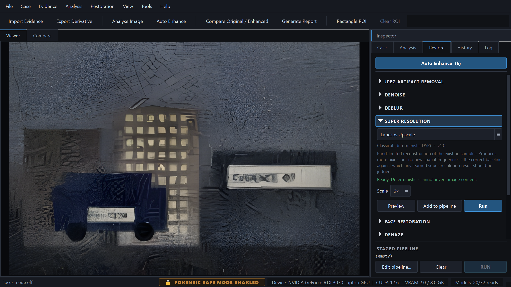

| Model | Task | Weights | Checkpoint verification |
|---|---|---|---|
| Real-ESRGAN x4plus / x2plus / 6-block | Super-resolution | Direct download | 702 keys, **0 missing / 0 unexpected**, 16.70 M params |
| SwinIR (classical SR, real SR, denoise, CAR) | SR / denoise / JPEG | Direct download | 550 keys, **0 / 0**, 11.90 M params |
| Restormer (motion, defocus, denoise) | Deblur / denoise | Direct download | 494 keys, **0 / 0**, 26.13 M params |
| FBCNN (colour, grayscale) | JPEG artefacts | Direct download | 184 keys, **0 / 0**, 71.92 M params |
| DnCNN (blind, sigma-25) | Denoise | Direct download | 40 keys, **0 / 0**, 0.67 M params |
| CodeFormer + YuNet | Face restoration | Direct download | 515 keys, **0 / 0**, 94.11 M params |
| NAFNet (deblur, denoise) | Deblur / denoise | Manual install | Config inferred from checkpoint; **never verified upstream** |
| Zero-DCE · Zero-DCE++ | Low-light exposure | Direct download | 14 and 28 keys, **0 / 0**, 0.079 M and 0.011 M params |
| GFPGAN | Face restoration | **Not integrated** | Blocker documented in-app |
| LaMa | Inpainting | **Not integrated** | Blocker documented in-app |

NAFNet is published only via Google Drive. Rather than invent a mirror URL, the
Model Manager shows the upstream location and offers *Install from file*.

### Measured results

On the bundled synthetic evidence, classical baseline vs. neural:

| Operation | Classical baseline | Neural |
|---|---|---|
| Denoise (σ ≈ 18/255) | Non-local means **+9.7 dB** | DnCNN blind **+14.4 dB** |
| JPEG q18 | Deblocking +0.1 dB, −15% blockiness | FBCNN **+3.5 dB, −73% blockiness** |
| Motion deblur | Wiener **+6.6 dB** | Restormer +2.5 dB |
| Defocus deblur | Richardson–Lucy **+1.9 dB** | Wiener **−1.2 dB** |
| Low light (clean) | Gamma 0.35 **+10.2 dB** | Zero-DCE++ **+12.7 dB** |
| Low light (with sensor noise) | Gamma 0.35 **+9.5 dB** | Zero-DCE++ **+9.6 dB** |

Gains are against the untouched degraded frame. The defocus row is why both
classes are kept: Wiener deconvolution scores *negative* on a pillbox kernel
because the transfer function has genuine zeros, and the tool documents that in
the operator's own description rather than hiding it.

The two low-light rows are the same lesson from the other direction. On a clean
dark frame Zero-DCE++ beats the best hand-set gamma curve by 2.4 dB. Add sensor
noise — which is what an actual low-light frame has — and the advantage
collapses to 0.03 dB, because brightening the shadows brightens their noise with
them at roughly five times the input sigma. Plain Zero-DCE *loses* to the
classical curve on that input. All four numbers are in
[docs/LIMITATIONS.md §13](docs/LIMITATIONS.md).

---

## Face restoration, and why it is fenced off

CodeFormer is fully integrated: detect (OpenCV YuNet) → align to the canonical FFHQ
frame via a 5-point similarity warp → restore → feathered blend back.

It also demonstrates the central risk of this entire application better than
anything else in it:

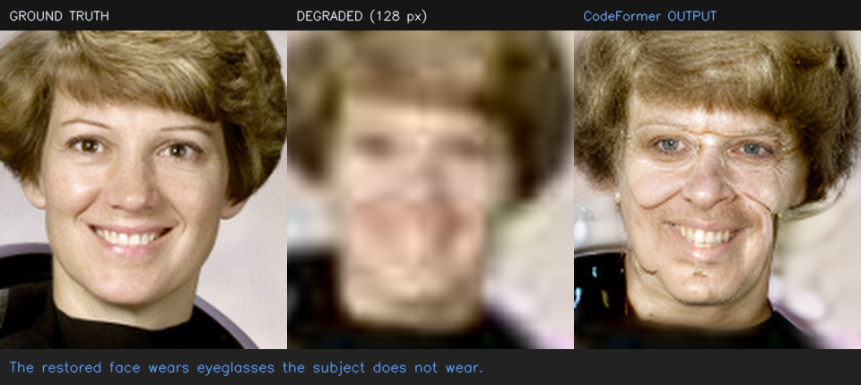

Run on the standard `astronaut` benchmark degraded to 128 px, CodeFormer produced a
sharp, confident, entirely plausible face — **wearing eyeglasses the subject does
not wear** — and additionally altered apparent age, face shape and hairline.
Nothing in the output distinguishes the measured features from the invented ones.

So it is fenced off:

- a face-specific confirmation dialog before every run;
- the inter-ocular distance of each source face is measured and recorded, with a
  warning below 30 px;
- the fidelity weight is exposed so the range can be swept and compared;
- every derivative is marked `may synthesise` in the database, the sidecar and the
  report.

**It must never be used for identification.** See
[docs/LIMITATIONS.md §5](docs/LIMITATIONS.md).

---

## Forensic Safe Mode

On by default. While enabled:

- imported originals are marked read-only on the filesystem;
- the original is never a valid write target for any operation;
- deleting evidence and editing the processing history are refused;
- every state-changing operation writes an audit entry recording the safe-mode
  state at the time;
- reports include the complete provenance chain.

The status bar shows `🔒 FORENSIC SAFE MODE ENABLED`. Turning it off requires
confirming an explicit warning and is itself audited.

---

## Using the engine without the GUI

The guiding architectural constraint is that the restoration engine must be
reusable without PyQt5. Nothing under `core/`, `analysis/`, `restoration/`,
`forensic/`, `database/`, `reports/`, `ocr/` or `detection/` imports Qt, with one
deliberate exception (`core/image_utils.py`, which exists solely to convert numpy
arrays to `QImage`).

```python
from analysis import analyze_image
from core.image_io import load_image
from restoration import register_all_models
from restoration.auto_engine import AutoRestorationEngine
from restoration.pipeline import PipelineRunner

register_all_models()
image = load_image("frame.jpg")
report = analyze_image(image)

recommendation = AutoRestorationEngine().recommend(report)
for step in recommendation.pipeline.steps:
    print(step.display_name, step.parameters, step.info().may_synthesise)
# FBCNN (colour)      {'override_quality': False, 'quality_factor': 50}  True
# CLAHE Contrast      {'clip_limit': 2.0, 'tile_grid': 8}                False
# Real-ESRGAN x4plus  {'scale': 4}                                       True

result = PipelineRunner(device="auto").run(image, recommendation.pipeline)
print(result.may_synthesise)                        # True
print(result.steps[-1].output_hashes.sha256)        # the derivative's digest
```

A CLI, an HTTP service or a video pipeline is a matter of writing a new front end.
See [docs/ARCHITECTURE.md](docs/ARCHITECTURE.md).

---

## Privacy and offline operation

- **No telemetry.** Nothing is measured, collected or transmitted.
- **No account, no activation, no licence server.**
- **No external API calls during normal processing.** The only network activity the
  application ever performs is a model-weight download you explicitly initiate from
  the Model Manager, to a URL it shows you first.
- Evidence never leaves your machine.

---

## Documentation

| Document | Contents |
|---|---|
| [docs/INSTALLATION.md](docs/INSTALLATION.md) | Windows and Linux setup |
| [docs/GPU_SETUP.md](docs/GPU_SETUP.md) | CUDA / PyTorch compatibility, VRAM, tiling |
| [docs/MODELS.md](docs/MODELS.md) | Every model, its licence and how to install it |
| [docs/PACKAGING.md](docs/PACKAGING.md) | Building the executable and AppImage |
| [docs/LIMITATIONS.md](docs/LIMITATIONS.md) | **What this tool cannot do** |
| [docs/ARCHITECTURE.md](docs/ARCHITECTURE.md) | Module layout and extension points |
| [THIRD_PARTY_LICENSES.md](THIRD_PARTY_LICENSES.md) | Licences of every integrated component |

**Read [docs/LIMITATIONS.md](docs/LIMITATIONS.md) before using any output in a
proceeding.** It is the most important file in the repository.

The same material, plus a screenshot walkthrough and a full user guide, is
published as a site at
**[sihabsahariar.github.io/ForensicVision](https://sihabsahariar.github.io/ForensicVision/)**
(source in [docs/index.html](docs/index.html) and
[docs/documentation.html](docs/documentation.html)).

---

## Keyboard shortcuts

| | | | |
|---|---|---|---|
| `Ctrl+N` | New case | `A` | Analyse |
| `Ctrl+O` | Import evidence | `Shift+A` | Analyse ROI |
| `Ctrl+S` | Export derivative | `E` | Auto enhance |
| `Ctrl+Shift+S` | Export as | `Shift+E` | Enhance ROI |
| `Ctrl+P` | Generate report | `Ctrl+R` | Run staged pipeline |
| `Ctrl+M` | Model manager | `Ctrl+D` | Compare |
| `F` | Fit to window | `R` | Reset view |
| `1` `2` `4` `8` | Zoom 100/200/400/800% | `C` | Crosshair |
| `Ctrl+1..4` | Rectangle/ellipse/polygon/freehand ROI | `Esc` | Cancel ROI |
| `F9` | Show/hide inspector | `F11` | Focus mode |
| `Alt+1..5` | Jump to an inspector tab | `Ctrl+Tab` | Cycle tabs |
| `Ctrl+Z` / `Ctrl+Shift+Z` | Undo/redo **view** change | | |

**Right-click on the image** for the context menu — analysis, visualisations, auto
enhance, selection tools, region actions, zoom, compare, copy pixel values and
export.

Undo affects the view only. Evidence is never modified, so there is nothing to undo
on it.

---

## Testing

```bash
python -m pytest tests/ -q          # 291 tests, ~42 s
python main.py --self-test          # functional end-to-end check, 13 stages
```

291 tests covering hashing, metadata, image I/O, case management, the database, all
nine analyzers, the model registry, tiling, pipelines, the auto engine, face
detection and alignment, CodeFormer restoration, the Zero-DCE curve properties,
provenance, safe mode, the GUI,
and a full end-to-end integration test that runs import → hash → analyse →
recommend → restore → derivative → hash → difference → history → PDF, then reads
the disclaimer back out of the rendered PDF.

`--self-test` is a *functional* harness, not a smoke test: it builds a real case in
a temporary directory, imports evidence, verifies integrity, runs classical and
neural inference, writes a derivative with its provenance sidecar and renders a PDF
report — then cleans up. It exists because the frozen Windows build once shipped a
silently broken PyTorch that looked exactly like a legitimate CPU-only
configuration.

---

## Roadmap

Contributions towards any of these are very welcome — see
[Contributing](#contributing).

### Next

- [ ] **Video and DVR support.** The single largest gap against commercial tools.
      The engine is already frame-agnostic; this needs container and codec
      handling, frame extraction with per-frame provenance, and a timeline UI.
- [ ] **Multi-frame super-resolution and stacking.** Averaging or aligning several
      frames of the same scene recovers *real* detail rather than inferring it —
      which makes it a much better fit for this project than any single-image
      generative model.
- [ ] **A proper CLI front end.** The engine is already headless; this is mostly
      argument parsing and progress reporting.
- [ ] **CPU-only packaging profile.** The current frozen build is 4.7 GB because of
      bundled CUDA libraries; a CPU-only profile should land at 400–600 MB.
- [ ] **Publish SHA-256 digests for every weight file.** Several upstream projects
      publish no digest, so the Model Manager currently shows *(not published)*.

### Verification and platform work

- [ ] **Test the Linux build on real hardware.** The AppImage script exists and has
      never been run on a Linux machine.
- [ ] **End-to-end OCR verification.** `pytesseract` is wired up, but the Tesseract
      binary path has not been exercised against real degraded text.
- [ ] **Verify NAFNet against a published checkpoint.** The architecture is
      implemented and the config is inferred from the checkpoint, but no upstream
      weights have ever been loaded, because upstream is Google-Drive-only.
- [ ] **macOS support.** Nothing is known to block it; it has simply never been
      run.
- [ ] Signed and reproducible release builds.

### Model integrations

- [ ] **GFPGAN** — declared, not integrated; the blocker is documented in-app.
- [ ] **LaMa** inpainting — same. Note that inpainting is *pure synthesis*, so if it
      lands it will carry the strongest warnings in the application.
- [ ] SCUNet and DiffBIR adapters.
- [ ] A benchmark harness that scores every operator against a standard degraded
      dataset and publishes the table, so the classical-versus-neural claims stay
      honest as models are added.

### Forensic capability

- [ ] **PRNU / sensor pattern noise** for source camera identification.
- [ ] **Manipulation detection** beyond ELA — CFA inconsistency, JPEG ghosts,
      copy-move detection. Each would have to be presented as an *indicator*, never
      a verdict.
- [ ] Photogrammetric measurement tools.
- [ ] Case export and import as a signed, self-verifying archive.
- [ ] Configurable report templates for different jurisdictions.

### Explicit non-goals

- Facial recognition, face matching, or identification of any kind.
- Any feature that presents a synthesised result without labelling it as one.
- Cloud processing, accounts, or telemetry.

---

## Contributing

Issues and pull requests are welcome. A few conventions matter more here than in
most projects:

1. **Never fake a result.** If an operation cannot run, it must say why. A missing
   model reports missing; it does not silently fall back.
2. **Every operator declares whether it can invent detail.** `may_synthesise` is
   not optional metadata — it drives the UI, the database and the report.
3. **Every estimator names its method.** Analysis results carry the raw
   measurements and the name of the estimator that produced them, because that text
   ends up in a report someone may have to defend.
4. **Nothing long-running touches the GUI thread.** Use a `BaseWorker`.
5. **Tests accompany behaviour changes.** Run `python -m pytest tests/ -q` before
   opening a pull request.

Adding a model or an analysis indicator is deliberately mechanical — see the
extension points in [docs/ARCHITECTURE.md](docs/ARCHITECTURE.md). Declared
`ParamSpec` entries generate their own GUI controls; there is no per-model UI code.

---

## Licence

ForensicVision is released under the **Apache License 2.0** — see
[LICENSE](LICENSE).

Two things to be aware of:

- The GUI links **PyQt5**, which is GPL-3.0 unless you hold a Riverbank commercial
  licence. Distributing a binary that bundles PyQt5 brings GPL obligations with it.
  The engine packages carry no such dependency.
- Integrated model **architectures and weights carry their own licences**, several
  of which restrict use to non-commercial research. The Model Manager shows each
  licence before installing anything.

See [THIRD_PARTY_LICENSES.md](THIRD_PARTY_LICENSES.md) and confirm the terms for
your intended use before deploying.

---

## Author

**Sihab Sahariar**

[](https://github.com/sihabsahariar)
[](mailto:sihabsahariarcse@gmail.com)
[](https://www.linkedin.com/in/sihabsahariar/)

If you use ForensicVision in research or casework, I would genuinely like to hear
about it — particularly about anything it got wrong.

## Acknowledgements

This project implements architectures published by others and loads their official
checkpoints. Credit belongs to the original authors:

[Real-ESRGAN](https://github.com/xinntao/Real-ESRGAN) (Wang et al.) ·
[SwinIR](https://github.com/JingyunLiang/SwinIR) (Liang et al.) ·
[Restormer](https://github.com/swz30/Restormer) (Zamir et al.) ·
[FBCNN](https://github.com/jiaxi-jiang/FBCNN) (Jiang, Zhang and Timofte) ·
[DnCNN](https://github.com/cszn/DnCNN) (Zhang et al.) ·
[NAFNet](https://github.com/megvii-research/NAFNet) (Chen et al.) ·
[CodeFormer](https://github.com/sczhou/CodeFormer) (Zhou et al.) ·
[YuNet](https://github.com/opencv/opencv_zoo) (Wu et al.) ·
and the OpenCV, PyTorch, NumPy, ReportLab, SQLAlchemy and Qt projects.

---

<div align="center">
<sub>

Algorithmic image enhancement modifies image data. AI-based restoration may infer
or synthesize structures that are not directly represented in the source image.
Enhanced imagery is a derivative representation and should not automatically be
interpreted as an exact recovery of information absent from the original evidence.

</sub>
</div>
